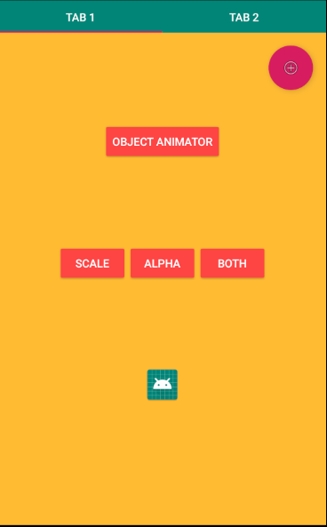
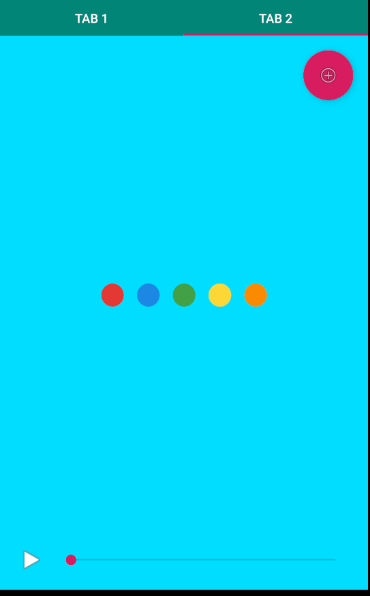
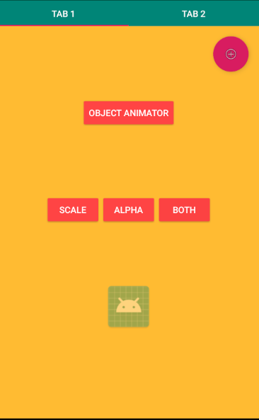
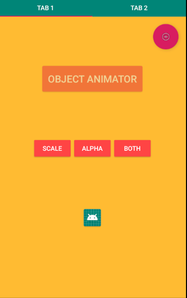
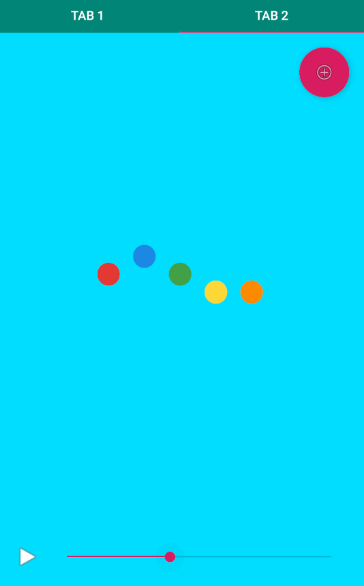
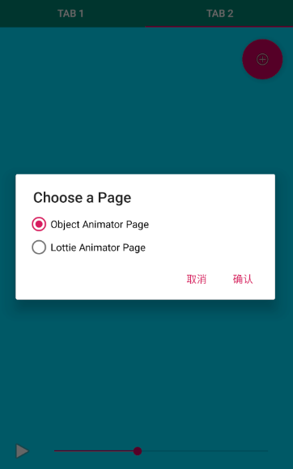
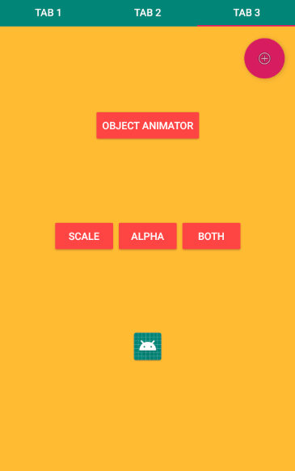
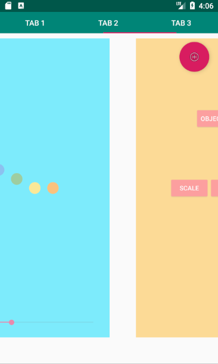

## 浙江大学安卓开发小学期 作业3

> 姓名：朱璟森
>
> 学号：3170104166
>
> 专业：计算机科学与技术

****

### 作业要求

创建一个Android app工程，实现

* Scale动画、Alpha动画，并组合到`AnimatorSet`中
* 使用`SeekBar`操纵`Lottie`动画进度条
* （选做）使用`TabLayout`和`ViewPager`实现页面切换

### 作业实现

注：为了节省代码量，本次作业中的所有回调事件全部采用**Lambda 表达式**进行编写而非传统的诸如
`new OnClickListener() {@Override ......}`的形式。

启动程序主界面如下，共2个TAB，分别为`Animator`动画与`Lottie`动画的页面，分别为两个自定义的`Fragment`。右上角还有一个悬浮按钮：

第一个页面中有四个按钮与一个图片。

* 中间的三个按钮点击后分别对图片施加动画效果，点击"SCALE"按钮后，图片放大至原来的2倍，点击"ALPHA"按钮后，图片的透明度缩小至0.1。这两个动画均为`Animation`而非`Animator`，而且会以`REVERSE`的模式循环执行一次，即放大至两倍后重新缩小回原形、变浅后变回原色。而"BOTH"按钮顾名思义即为两种动画效果的同时叠加，也会循环执行一次变回原形。下图为执行"BOTH"的中途截图：

* 上方的"OBJECT ANIMATOR"按钮，点击后会对这个按钮本身执行一个以`REVERSE`的模式无限循环的`ObjectAnimator`，即放大变浅->缩小变深->放大变浅->缩小变深->...的循环。放大和变浅的同时实现就是使用的`AnimatorSet`的`playTogether`方法。由于`Animator`为属性动画，因此按钮放大后点击区域也会变大。中途截图如下：

第二个页面中，`Lottie`动画默认静止不播放，拖动进度条，`Lottie`动画就会快进到相应的进度，如图：

而点击左下角的播放按钮，就会播放一次`Lottie`动画。播放途中按钮与进度条被停用，播放完毕后重新启用。

### 进阶要求

除了基本要求，我还实现了一些额外的功能与效果：

#### `ObjectAnimator`的暂停

在第一个页面点击"OBJECT ANIMATOR"按钮后，按钮的点击事件变为暂停动画，即再次点击按钮后动画定格在点击时的状态，再次点击按钮，动画则又会从暂停时的动画继续。

#### 新建Tab标签页

右上角的悬浮按钮的作用就在于新建标签页，点击后会弹出如下对话框 (`AlertDialog`) 选择想要新建的页面：

点击确认后就会新建页面并切换到新建的页面上：

由于每个页面均为`Fragment`，具有独立的生命周期，除非被系统销毁，否则各页面的状态会保持，例如此时滑动回TAB 2，进度条进度与之前一样。

#### 换页动画

在`ViewPager`滑动换页时，通过实现自定义`ViewPager.PageTransformer`接口，就可以做出自定义换页动画效果。本次作业中的效果为页面缩小并变浅 (Alpha变小) ，如下图所示：

### 总结心得

本次作业，巩固了课内内容，安卓的动画效果使得App界面显得更为炫酷，而`Fragment`得益于其生命周期，使得实现页面切换时不一定要创建新的`Activity`，更是为导航换页打下了基础。`TabLayout`和`PageViewer`的实现让我对`Fragment`的作用有了更深刻的理解，而`PageViewer`中实现`Adapter`与昨天的`RecyclerView`有着异曲同工之妙，温故而知新。最有挑战性的莫过于编写换页动画，经过不断的试错和努力终于实现了酷炫的换页效果。